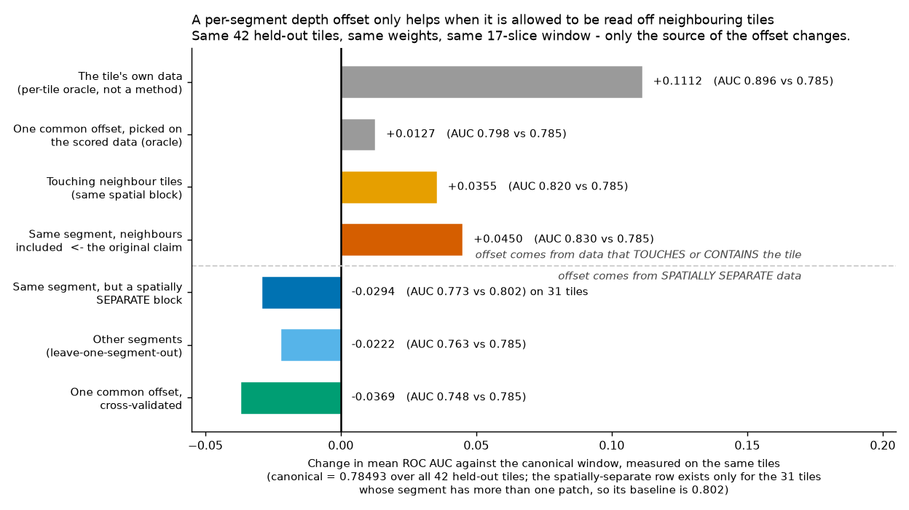
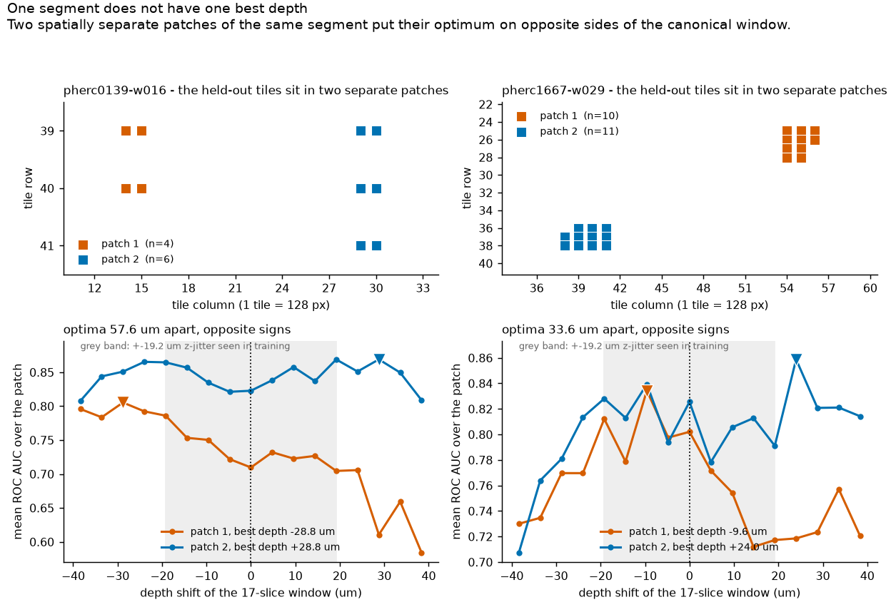
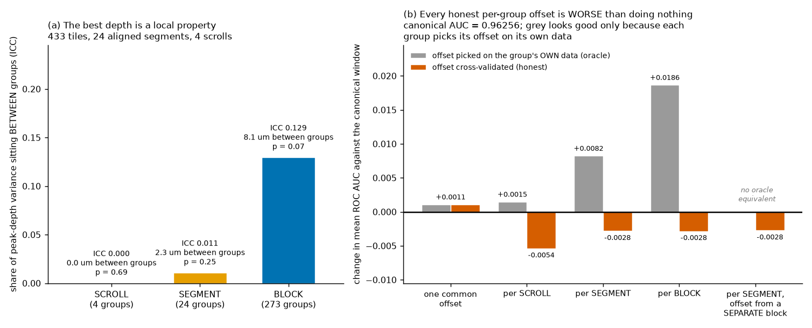

# The depth the ink_9um model wants is not a per-segment number

The `ink_9um` model card notes that per-scroll models still beat the pooled one and asks
why. I thought part of the answer was depth: that each segment render sits at a slightly
wrong z and that one scalar per segment would fix it. I measured it, got a good-looking
number, and then spent longer trying to break it than to find it. It broke.

**Short version.** Window depth matters a lot. Picking the best depth per *tile* is worth
**+0.111 AUC** on the held-out data. But that optimum is not shared at segment scale. Two
patches of the *same* segment, about 2000 pixels apart, want depths **57.6 um apart and on
opposite sides of zero**. Across 433 tiles the share of the best-depth variance that sits
*between* groups is 0.000 for the scroll, 0.011 for the segment and 0.129 for the local
patch. And under honest cross-validation **no per-group offset policy beats leaving the
window alone**: per-scroll -0.0054, per-segment -0.0028, per-block -0.0028.

So the useful result here is a negative one, and a fairly specific one: **do not spend
effort estimating one z-offset per segment.** The depth error is real and it is large, but
it lives below segment scale, and a single scalar per segment cannot reach it.

---

## There is a second experiment in this repo: [`experiment2/`](experiment2/README.md)

It started as a different question - whether the pooled model is held back because 24 of its
29 training representations are *derived* 9.6 um data while all 13 prize-eligible scrolls
are *native* 9.362 um scans - and five physical PHerc0139 segments are published in both
representations, so that is a free controlled comparison. The answer to that question is a
negative: with the tiles matched, no measurable difference. The number a first draft of mine
put in its headline, +0.0020 peak AUC, turns out to be an averaging artefact; the tile
median is +0.00005.

The reason to read it is what fell out while I was making that comparison fair.

**The published checkpoint's output depends on where the 128x128 patch starts.** Score the
same pixels against the same labels and move only the window origin: shifts that are a
multiple of 8 px cost nothing (|delta AUC| <= 0.008); shifts that are not cost up to
**-0.13 mean AUC** on a single patch. In real sliding-window inference with Hann blending,
every stride that is a multiple of 8 lands within 0.0006 of the default and the off-grid
strides cost **-0.005 to -0.032**, in every measurement. That is reachable from the shipped
CLI, because `stride = round(128 * (1 - overlap))`, so of the ten one-decimal `--overlap`
values a person might type, **eight are off the grid**. `--overlap 0.3` costs 0.032 AUC
against the default for nothing.

The practical line: **put patch origins on a multiple of 8, preferably 32** (the training
`stride_xy`), which with the CLI means an `--overlap` of 0, 0.25, 0.375, 0.5, 0.75 or
0.875. The default 0.5 is already safe.

I reproduced the effect on three independent code paths and ruled out fp16, input
normalisation and uneven blending coverage - and **could not explain it**: the architecture
predicts a period of 32 and the measured period is 8. The behaviour is measured; no
mechanism is claimed. Every measurement there is inside the training region and on one
scroll, and `experiment2/README.md` says so where it matters.

---

## What was measured

Three segments in the public `ink_9um` release carry a `validation_mask`:
`pherc0139-w016`, `pherc0814-46527`, `pherc1667-w029`, one per scroll. The checkpoint
config lists exactly those three as `online_validation_cases`, so they are the release's
own held-out set. I checked that `supervision_mask` and `validation_mask` share no pixel on
any of the three, so the held-out region really is held out.

For each of their 42 labelled tiles I built 17 model inputs from the same raw planes,
shifted by -16 to +16 source voxels (2.399 um each, so +-38.4 um in steps of 4.8 um). The
window is always exactly 17 pooled slices and never zero-padded, and only its depth moves.
Same weights (`hybrid_3d2d-seed42/step-075000`), same normalization, same everything else.
A second sweep covers 433 tiles over 24 aligned segments in 4 scrolls, this time on the
supervision region.

`data/tile_scan_531.json` holds 531 tiles, not 433. The 98 that the analysis leaves out are
the `native9` family, and they are excluded for one reason: they were swept on a different
depth grid (11 points at 9.362 um, +-46.8 um) from the 17 points at 4.8 um, +-38.4 um
used everywhere else, so their per-tile peaks are not measured on the same axis and cannot
go in the same table. They also all come from a single scroll (PHerc0139, 5 segments), so
they carry no between-scroll contrast. Both facts are checkable in the committed file: group
its rows by `family` and compare the `um` grids.

Two things are derived rather than assumed: the window position comes from the label
metadata (`source_z_slice`, the label depth, `annotation_center_channel`), and the input
depth comes from the checkpoint config. I also wrote the measurement twice, independently,
and the two implementations agreed on every one of the 42 tiles to five decimal places of
AUC. Only the second one is in this repo.

## The number that looked good

Let each tile take its depth from the *other* tiles of its own segment, a leave-one-tile-out
scheme that sounds honest. Mean ROC AUC over the 42 held-out tiles goes from **0.785 to
0.830**: **+0.045**, better on 31 of 42 tiles, Wilcoxon p = 0.0032.

That is the number I would have published. Here is why I did not.

The 42 held-out tiles are not scattered over the segments. They sit in five compact
patches, so "the other tiles of the same segment" are mostly the tiles physically
*touching* the one being predicted. Learning a tile's depth from the tile next to it is not
evidence that the segment has a depth.



Force the offset to come from a spatially *separate* patch of the same segment and the gain
does not shrink, it inverts: **-0.029**, better on 13 of 31, p = 0.28. Take it from another
segment entirely and it is -0.022. A single common offset, cross-validated, is -0.037.

The obvious objection is sample size: the out-of-patch estimate uses fewer source tiles, so
maybe it is just noisier. It is not. Drawing the *same number* of source tiles at random
from the same segment, neighbours allowed, gives +0.007, 95% interval [-0.020, +0.030]
over 2000 draws. The out-of-patch result sits at the 0.5th percentile of that
size-matched distribution, p = 0.0055. The difference comes from spatial adjacency, not
from how many tiles were used.

## The same segment does not have one depth



Pooled over each patch:

| segment | patch 1 | patch 2 | gap |
|---|---|---|---|
| pherc0139-w016 | **-28.8 um** | **+28.8 um** | 57.6 um, opposite signs |
| pherc1667-w029 | **-9.6 um** | **+24.0 um** | 33.6 um, opposite signs |
| pherc0814-46527 | +33.6 um | one patch only | n/a |

Whatever this offset is a property of, it is not the segment.

## At 433 tiles the ordering is scroll < segment < patch

The wider sweep lets the levels be compared directly. Letting each group pick its own best
depth on its own data (the in-sample view, which is what an oracle would get):

| level | mean AUC | added over the level above |
|---|---|---|
| canonical window | 0.96256 | n/a |
| one common offset | 0.96363 | +0.00107 |
| per scroll | 0.96402 | +0.00039 |
| per segment | 0.97078 | +0.00676 |
| **per spatial block** | **0.98121** | **+0.01042** |
| per tile | 0.98201 | +0.00081 |

The block level adds *more* than the segment level, but that row is not evidence on its
own. 273 blocks over 433 tiles is a mean of 1.6 tiles per block, so a block "oracle" is
close to a per-tile oracle by construction and is inflated by degrees of freedom; note how
near 0.98121 sits to the 0.98201 of the per-tile row. **I do not use this table as an
argument for the block.** The block claims I do make rest on the ICC below (0.129) and on
the held-out blocks, which hold 4 to 11 tiles each. The same ordering shows up in the
variance of the per-tile best depth: between-group standard deviation is 0.00 um for the
scroll (ICC 0.000, p = 0.69), 2.33 um for the segment (ICC 0.011, p = 0.25) and 8.12 um for
the block (ICC 0.129, p = 0.071), against 21 to 23 um within groups in every case.



*In panel (b), the tallest grey bar is the per-block oracle (+0.0186). It is the degrees-of-freedom
artefact described just above (1.6 tiles per block), not a result. The red bars are the honest ones,
and all of them are at or below zero except the single global offset.*

And when the same policies are cross-validated instead of fitted in-sample, all of them
lose to doing nothing:

| policy, cross-validated | change vs canonical |
|---|---|
| one common offset | +0.00107 |
| per scroll | **-0.00540** |
| per segment | **-0.00284** |
| per block | **-0.00285** |
| per segment, offset from a separate block | **-0.00275** (better on 134/433, p = 1.8e-07) |

Only a single global shift helps at all, and by +0.001, a shift that has nothing to do
with segments.

## The deployment test

In practice you hold the labelled supervision region and want to predict a different one.
So: estimate the offset on supervision, apply it to the held-out region. I swept 47
supervision tiles for this, with validation pixels excluded from the scoring mask.

| segment | supervision peak | held-out AUC with it | held-out AUC at k=0 | difference |
|---|---|---|---|---|
| pherc0139-w016 | -28.8 um | 0.833 | 0.778 | **+0.055** |
| pherc0814-46527 | +0.0 um | 0.736 | 0.736 | **0.000** |
| pherc1667-w029 | -9.6 um | 0.837 | 0.814 | **+0.023** |
| all 42 tiles | | **0.809** | **0.785** | **+0.024** |

That is positive, and it is the fairest test in here. But it is not stable. Resampling the
supervision tiles and re-estimating the offset 5000 times gives a bootstrap mean of +0.011
with a **95% interval of [-0.017, +0.032]** and P(gain > 0) = 0.77. With the segment as the
unit of analysis, n = 3, mean +0.026, t-test p = 0.247.

The reason is visible in the curves: the supervision region is near ceiling, so its peak is
chosen from almost nothing. On pherc0814 the supervision AUC spans 0.99798 to 0.99955,
a range of 0.0016 across the whole +-38 um sweep. Split those tiles in half and the two
halves pick peaks a median of 9.6 to 24.0 um apart.

## What survives, and what I am not claiming

**The depth effect itself is real.** Per-tile oracle depth is worth +0.111 AUC. A
permutation test that shuffles the segment labels puts the real grouping at p = 0.0041, so
the grouping does capture *something*. It is just that block grouping is significant too
(p = 0.018) and out-of-block transfer fails, which points at the local patch rather than
the segment.

**The scroll is not the unit.** That part of my earlier reading held up and got stronger:
scroll ICC is 0.000 with p = 0.69 over 433 tiles. Stated carefully, that is a failure to
detect rather than a measured absence: with four scrolls the between-scroll variance
component estimates to zero (F = 0.49), which is not the same as showing it is zero.

**The sign depends on the metric.** Out-of-block cross-validation is -0.029 on AUC-ROC but
**+0.033 on AUC-PR** (p = 0.061). One metric says the transfer hurts, the other says it
helps. I could not resolve this, and it alone rules out any confident language about
direction.

**The +0.045 is heavy-tailed.** Mean +0.045, median +0.027, sd 0.099; the largest single
tile contributes +0.458. Drop the best 5 tiles and it is +0.019.

**42 tiles are not 42 independent observations.** There are three segments, and every tile
of a segment uses the same chosen offset. Tile-level p-values overstate what is known.

Other limits: one checkpoint, one seed. Inference is a single 128x128 patch per tile with
no overlap blending, unlike `infer.py` defaults. Every arm gets the same treatment so the
comparisons hold, but absolute AUC will differ from the official path. Tiles were chosen
where validation labels exist, which skews toward inked areas, so false positives on blank
papyrus are not measured.

An earlier, coarser sweep of mine (9.6 um grid, +-48 um, AUC pooled over all pixels of a
region rather than computed per tile) puts `pherc1667-w029` at **+28.8 um** where the fine
sweep says **-9.6 um**. That looked like a contradiction and was the thing that made me
start checking. It is at least consistent with what the rest of this note says: a
region-pooled sweep averages over patches that want different depths, so its answer depends
on which patches happen to dominate. I cannot prove that is the whole explanation, and the
sign of that segment's offset should be treated as unsettled either way.

## One correction worth stating plainly

The training config (`aligned21_hybrid_3d2d.json`, also embedded in the checkpoint, where
`verify/03` prints it) contains:

```
flat_z_window_jitter: {enabled: true, max_offset: 2, window_depth: 17,
                       probability: 1.0, padding: forbidden, training_only: true}
```

The model is trained with +-2 pooled slices = **+-19.192 um of random z-window jitter, at
probability 1.0**. So there *is* a procedure for z; it is augmentation rather than
alignment. Any claim that z is unhandled, including an earlier draft of my own, is wrong,
and this is also a plausible reason why a per-segment shift buys so little: the model has
already been made insensitive to shifts of roughly this size.

Two of the three measured optima (-24.0 and +33.6 um) fall outside that jitter range.
Restricting the offset search to +-19.2 um drops the (neighbour-leaking) gain from +0.045 to
+0.033.

## What I would do instead

If depth is worth correcting at all, the shape of the fix is a **per-patch depth map**, not
one scalar per segment. It would also need a label-free criterion to choose the depth at
inference time, which I have not built. Widening `flat_z_window_jitter.max_offset` from 2 to
4 (+-38.4 um) would cover the spread I measured; that is a one-line change and I have not run
the retraining, so it is a suggestion with a measurement behind it, not a result.

The concrete thing anyone can take from this: per-segment z re-estimation looks like it
works if you validate it on neighbouring tiles, and stops working when you do not. If you
try it, split by spatial block, not by tile.

## Reproduce it

Everything quoted above comes out of the committed data with numpy, scipy and matplotlib.
No GPU, no downloads, no villa:

```
pip install numpy==2.5.2 scipy==1.18.1 matplotlib==3.11.1

python verify/04_reproduce.py      # the +0.045 and its p-values
python verify/05_hard_tests.py     # block CV, permutation null, distribution, jitter
python verify/06_scale.py          # scale decomposition, AUC-PR check
python verify/07_controls.py       # size-matched control, policy table
python verify/09_stability.py      # bootstrap on the supervision -> held-out transfer
python verify/10_all_tiles.py      # the 433-tile analysis
VZ_OUT=data python verify/11_collect.py    # rebuilds data/verification.json
python make_figures.py             # redraws the three figures
```

The second experiment reproduces the same way, from its own committed data and the same
three packages; see [`experiment2/README.md`](experiment2/README.md):

```
python experiment2/verify/01_phase.py         # the patch-phase effect and its controls
python experiment2/verify/02_blended.py       # what it costs in blended inference
python experiment2/verify/03_paired.py        # the paired family comparison
python experiment2/verify/04_confounders.py   # noise floor, placebos, corpus exposure
python experiment2/make_figures.py            # redraws its two figures
```

`experiment2/verify/04_confounders.py` reads `data/tile_scan_531.json` from this directory
and re-grids it, so the two experiments share a raw measurement.

Run in that order from a fresh checkout and `data/verification.json` and all three PNGs
come back byte for byte identical to the committed ones. Every seeded procedure
(permutation null, bootstraps, the size-matched control) uses a fixed seed.

Steps 1, 2, 3 and 8, and the first half of step 10, redo the measurement itself. Those need
a CUDA GPU (this ran on an 8 GB laptop 4060), the villa package, the checkpoint and the
label and volume chunks. They read their inputs from two directories:

- `VZ_ROOT` holds `villa/`, `model/ink_9um/hybrid_3d2d-seed42/step-075000.pth`,
  `cache/labels/` (label chunks sharded by the first two characters of the content hash),
  `cache/volumes/` (`<segkey>__<y>_<x>.npy`), and `segments.json`
- `VZ_WORK` is where intermediate files are written; it defaults to `work/`

`segments.json` is a manifest with a top-level `segments` list; each entry needs `key`,
`segment`, `scroll`, `family`, `source_z_slice`, `label_shape_zyx`, `label_chunk_zyx`,
`volume_level_chunk_zyx`, `annotation_center_channel` and `volume_base_voxel_um`. Labels
come from `huggingface.co/buckets/scrollprize/datasets/.../ink_9um/labels/`, volumes from
`vesuvius-challenge-open-data.s3.amazonaws.com`, the checkpoint from `scrollprize/ink_9um`.

## What is in here

```
verify/01_label_index.py            label chunk index, and which blobs are missing
verify/02_select_tiles.py           held-out tile selection + the supervision/validation overlap check
verify/03_measure_heldout.py        the sweep: 42 held-out tiles x 17 depths
verify/04_reproduce.py              cross-validation, conservative test, cluster bootstrap, LOSO
verify/05_hard_tests.py             spatial block CV, permutation null, gain distribution, jitter
verify/06_scale.py                  segment vs block vs tile, distance-similarity, AUC-PR
verify/07_controls.py               size-matched control, spatial gradient, policy summary
verify/08_supervision_transfer.py   supervision -> held-out transfer
verify/09_stability.py              bootstrap CI for the transfer gain
verify/10_all_tiles.py              433 tiles: oracle vs honest CV, variance components
verify/11_collect.py                collects everything into data/verification.json
make_figures.py                     the three figures
data/verification.json              every number quoted above
data/tile_scan_531.json             the full sweep: 433 aligned tiles at 17 depths, plus
                                    98 native9 tiles on a coarser grid, excluded above
experiment2/                        the second experiment: the patch-phase effect, and
                                    the paired representation-family negative. Its own
                                    README, data, verify scripts, GPU measurement
                                    scripts and figures live under that directory.
```

`data/verification.json` holds the two raw measurements (`heldout_scan`,
`supervision_scan`) plus everything derived from them; the derived sections are exactly
what steps 4 to 10 print, so they can be regenerated and checked against the file.

The 98 native9 tiles that this experiment excludes are exactly the ones `experiment2/`
goes on to use, on a common in-phase grid and paired against their aligned twins.
