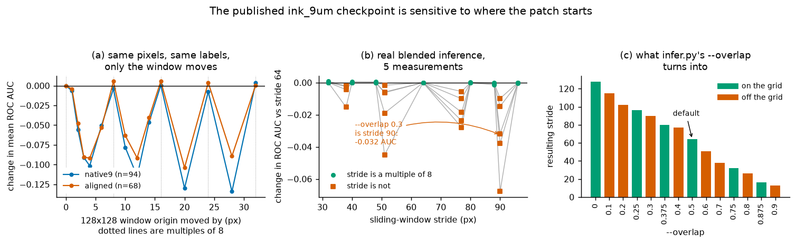
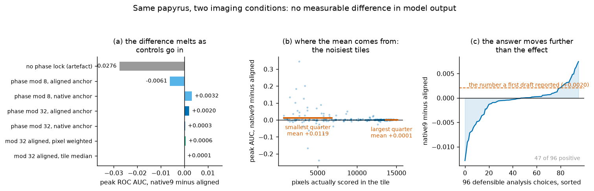

# The ink_9um checkpoint cares where the patch starts

I set out to test whether the pooled `ink_9um` model is held back by the fact that most of
its training corpus is a *derived* 9.6 um representation while everything it will be
deployed on is a *real* 9.362 um scan. The corpus has 29 representations: 24 pooled from a
2.4 um scan, 5 native. All 13 prize-eligible scrolls are native. That looked like a
distribution mismatch worth measuring, and there is a free controlled experiment sitting in
the public data: five physical PHerc0139 segments are published in **both** representations.
Same papyrus, same ink, same annotation, one variable changed.

The family hypothesis did not survive. What did survive is something I found only because I
was trying to make the comparison fair.

**Short version.** The published checkpoint's output depends on where the 128x128 window
starts. Move the window and score the *same* pixels against the *same* labels: shifts that
are a multiple of 8 px, up to 32 px, cost nothing in the tile scans (|delta AUC| <= 0.008),
and shifts that are not cost up to **-0.13 mean AUC** on a single patch in the one-axis tile
scan (up to -0.23 in a 12-block reproduction). In real
sliding-window inference with Hann blending, the six on-grid strides I tested land within
**0.0006** of the default on average, and the four off-grid strides cost **-0.005 to
-0.032** on average, each worse than the default in 5 of 5 measurements. This is reachable
from the shipped CLI: `stride = round(128 * (1 - overlap))`, so of the ten one-decimal
`--overlap` values a person might type, **eight are off the grid**. `--overlap 0.3` costs
0.032 AUC on average against the default (5 of 5 measurements) for no reason at all. I could not explain *why* the period is
8 and I am not claiming a mechanism - see "What I could not explain" below.

And the family question: with the phase locked and the tiles matched, **no measurable
difference**. The pre-registered primary metric is null (-0.005, 3/5, p = 0.50). The
secondary metric that a first draft of mine put in the headline, +0.0020 peak AUC, turned
out to be an averaging artefact: the tile median is **+0.00005**, and 85% of the mean comes
from the most extreme 5% of tiles, which are the ones with the fewest scored pixels.

**Everything below was measured inside the training region.** The same checkpoint scores
0.785 on the release's own held-out set and 0.988 here. None of this is a statement about
generalisation, and I have not made one.

---

## 1. The patch phase



### What was done

Take a tile. Build the 17-slice input, run the checkpoint, and score a fixed 64x64 region
in *global* coordinates. Now move the 128x128 window origin in y and run again. The scored
pixels do not move. The labels do not move. The z window does not move. Only the patch
boundary does.

| shift (px) | 0 | 1 | 2 | 3 | 4 | 8 | 12 | 16 | 20 | 24 | 28 | 32 |
|---|---|---|---|---|---|---|---|---|---|---|---|---|
| native9, n=94, mean delta AUC | 0 | -0.007 | -0.056 | -0.091 | **-0.102** | -0.004 | -0.115 | +0.001 | -0.130 | -0.007 | **-0.134** | +0.003 |
| aligned, n=68, mean delta AUC | 0 | -0.004 | -0.048 | -0.090 | -0.092 | +0.005 | -0.092 | +0.006 | **-0.104** | +0.004 | -0.089 | +0.001 |

The period is 8. Multiples of 8 are free, and so, in this scan, is a 1 px shift (-0.007
native9, -0.004 aligned); in it, every shift 2 px or more from a multiple of 8 costs at least
0.04. This scan samples only some odd shifts; in it the worst case is 4 away from a multiple
of 8, while the 1 px-dense reproduction puts the worst case of every period 5 px past a
multiple of 8. The same shape appears in x, and in both axes at once.

Two things about that table that I would rather state than have someone find:

- **The mean overstates the typical tile.** At shift 4 the median tile loses 0.034
  (native9) and 0.031 (aligned). A handful of tiles collapse; most degrade moderately.
- **It is not a scoring artefact.** Section 6 of `verify/01_phase.py` compares the two
  logit maps directly with no labels and no AUC anywhere: on native9 the mean logit
  correlation is 0.56 at multiples of 8 and 0.15 elsewhere; on aligned, 0.49 against 0.25.

### Things it is not

| candidate explanation | test | result |
|---|---|---|
| fp16 numerics | rerun 24 tiles at 6 window shifts in fp32 | largest fp16/fp32 gap 0.00011 |
| per-window input normalisation | normalise once over the whole block instead | shift-4 cost -0.15769 vs -0.15819 |
| a bug in my scoring code | rewrite the measurement from scratch, second code path (output in `phase.json`; that code is not in this repo) | period 8, loss -0.15 to -0.23 |
| uneven coverage in blended inference | compare neighbouring strides (see below) | ruled out, 5/5 in four pairs |

### What it costs in real inference

A single patch is not how anyone runs this model. So: sliding window with Hann blending,
positions chosen exactly the way `_sliding_positions_1d` chooses them, a 512x512 region
scored on its inner 384x384 with 64 px of blend edge discarded. Five measurements over four
physical segments. Only the stride changes.

| stride | mod 8 | mean delta vs stride 64 | worse in |
|---|---|---|---|
| 32, 40, 48, 80, 88, 96 | 0 | +0.0002 to -0.0005 | - |
| 38 | 6 | **-0.0053** | 5/5 |
| 51 | 3 | **-0.0156** | 5/5 |
| 77 | 5 | **-0.0172** | 5/5 |
| 90 | 2 | **-0.0325** | 5/5 |

The obvious objection is that off-grid strides tile the region differently, so maybe this is
coverage rather than phase. It is not. Pick pairs of *neighbouring* strides, where the
coverage geometry is nearly identical and essentially the only difference is whether the
stride is a multiple of 8:

| pair | mean delta | worse in |
|---|---|---|
| 48 -> 51 | -0.0156 | 5/5 |
| 80 -> 77 | -0.0171 | 5/5 |
| 88 -> 90 | -0.0319 | 5/5 |
| 40 -> 38 | -0.0053 | 5/5 |

All four go the same way in all five measurements.

### Why this is reachable from the shipped code

`inference/infer.py`, `resolve_patch_stride`:

```
stride = max(1, int(round(patch_size * (1.0 - overlap))))
```

| --overlap | 0 | 0.1 | 0.2 | 0.25 | 0.3 | 0.375 | 0.4 | **0.5** | 0.6 | 0.7 | 0.75 | 0.8 | 0.875 | 0.9 |
|---|---|---|---|---|---|---|---|---|---|---|---|---|---|---|
| stride | 128 | 115 | 102 | 96 | 90 | 80 | 77 | **64** | 51 | 38 | 32 | 26 | 16 | 13 |
| multiple of 8 | yes | no | no | yes | no | yes | no | **yes** | no | no | yes | no | yes | no |

The default is safe. Eight of the ten one-decimal values are not.

There is a second, smaller thing in the same function: `_sliding_positions_1d` appends
`length - patch_size` to the end of every row and column so the edge is covered. That
position is generally not a multiple of the stride, so the last patch row and column of
every official run sit off the phase grid. **I did not measure what that costs.** It is
confined to an edge strip, and it is an inference from reading the code, not a result.

### The rule

> When you run this checkpoint, put the patch origins on a multiple of 8, and preferably on
> a multiple of 32, which is the stride the model was trained with (`stride_xy = 32` in the
> checkpoint's own provenance block). With the CLI that means choosing an `--overlap` whose
> stride is a multiple of 8: 0, 0.25, 0.375, 0.5, 0.75, 0.875. Otherwise you lose 0.005 to
> 0.032 AUC on average in blended output, and 0.09 to 0.13 on a single patch in the one-axis tile scan
> (up to 0.23 in the 12-block reproduction), silently.

Quote those two ranges separately. They are different measurements and the single-patch
number is not what a deployment run experiences.

### What I could not explain

The model's own autoconfigure block says `num_pool_per_axis = [5, 5]`,
`must_be_divisible_by = [32, 32]`, five stride-2 stages, `Conv2d` with `InstanceNorm2d`.
That architecture predicts a shift-equivariance period of **32**. The measured period is
**8**. I do not know why, and I am not going to write a mechanism I did not test.
`InstanceNorm2d` is a candidate, because it makes every window's output depend on the
window's global statistics, but that would explain why multiples of 32 are not *exactly*
equivalent - and they are not, the logit correlation at shift 32 is only 0.90 - and it does
not explain a period of 8.

So: the behaviour is measured on three code paths (the single-patch scan and blended
inference in `measure/`, which share their loading and scoring code, and a second
implementation whose output is in `phase.json` but whose code is not in this repo), with its
main competing explanation ruled out. The reason is open.

---

## 2. The family question, which is the negative result



### The design

Five physical PHerc0139 segments, each published twice. The pairing is not from the names -
it comes from the `volume_url` in the public segment metadata, and it matters, because one
of the aligned labels is *named* `pherc0139-w028` while its volume sits in the segment
folder `20260115000000-w044_2026011522`. It is physically w044. Every pairing is listed in
`data/context.json` with both S3 URLs.

The geometric transform between the two representations was fitted to label geometry alone
and frozen before any AUC was computed. The tile list was generated from geometry, locked,
and never edited afterwards. Analysis unit is the segment, n = 5. No tile-level p-value
appears anywhere in this repo - the tiles are spatial clusters and are not independent.
That was the exact mistake that sank an earlier report of mine.

### The first run was wrong, and the phase finding is why

The first run had no phase constraint. Its result: peak AUC, native9 minus aligned,
**-0.0276, 5/5 segments**. A clean-looking headline.

Then I counted the window origins. Of 352 tiles, the aligned window was on a multiple of 8
in **352**. The native window was on a multiple of 8 in **3**. The whole result was section
1 wearing a costume. It is in `data/paired_tiles.json` as the run named `unlocked`, and
`verify/03_paired.py` counts it for you, because "an artefact I caught" is only worth
anything if you can check it.

### The pre-registered primary metric

The experiment was registered on one primary metric: the peak-aligned drop in AUC at +-2 z
steps, i.e. how sharply the model degrades as the window moves in depth.

| run | difference | same direction | sign-flip p | tile median |
|---|---|---|---|---|
| mod 32, aligned anchor | -0.00467 | 3/5 | 0.500 | +0.00002 |
| mod 32, native anchor | -0.00335 | 3/5 | 0.375 | -0.00012 |

Null. That is the answer to the question the experiment was designed to ask.

### The secondary metric, and why I am not reporting it as a result

Peak AUC gives +0.00204 (aligned anchor) and +0.00030 (native anchor). The first of those
is the number my first draft put in the headline. Six ways of aggregating the identical
per-tile numbers:

| aggregation | aligned anchor | native anchor |
|---|---|---|
| mean over tiles (what got reported) | +0.00204 | +0.00030 |
| **median over tiles** | **+0.00005** | **+0.00005** |
| 20% trimmed mean | +0.00014 | +0.00011 |
| pixel weighted | +0.00057 | +0.00010 |
| largest quarter of tiles | +0.00005 | +0.00003 |
| tiles where both families are above 0.99 (about 80%) | **-0.00005** | +0.00008 |

The mean is carried by a handful of tiles: the most extreme 5% account for 85% (aligned
anchor) and 103% (native anchor) of the total. Those tiles have **3939** and **4287**
scored pixels against **10520** and **10512** for the rest, and their aligned AUC is 0.87
and 0.83 against 0.99. They are not badly registered - their label Dice is the same as
everyone else's. They are just small, which makes their AUC noisy. Split the tiles by how
many pixels they score and, in the aligned-anchor run, the smallest quarter gives +0.0119
with a mean absolute difference of 0.031 while the largest quarter gives +0.0001 with
0.0007.

Weight the evidence by how much evidence there is, and the difference is zero.

### Does the answer survive the analysis choices

96 defensible combinations of anchor, phase lock, scoring frame, aggregation and metric:

| metric | mean | range | positive |
|---|---|---|---|
| peak AUC | -0.00018 | [-0.00692, +0.00320] | 15/24 |
| AUC at offset 0 | +0.00012 | [-0.01282, +0.00746] | 15/24 |
| drop at 1 step | -0.00053 | [-0.00484, +0.00294] | 8/24 |
| drop at 2 steps | -0.00133 | [-0.00858, +0.00694] | 9/24 |

The peak-AUC choice space is 0.0101 wide - about five times the number a first draft would
have reported - and 47 of 96 choices come out positive. Also worth saying plainly: 70% of
the aligned-anchor effect comes from a single segment, w040.

### How much difference would have to exist before this design could see it

Between-segment standard deviation is 0.0033 (aligned anchor) and 0.0078 (native anchor),
so the smallest effect this design would detect 80% of the time is about **0.0055** and
**0.0129**. The observed values are 37% and 2% of that. With n = 5, the smallest p a
two-sided sign-flip permutation can return is **0.0625**, so nothing here can be
"significant" and saying "not significant" carries no information.

**This is not an equivalence proof.** An effect smaller than roughly 0.005-0.013 AUC cannot
be detected here at all. The sentence I can defend is *"no difference measurable"*, never
*"no difference exists"*.

### Two confounders that produce this size of difference on their own

`verify/04_confounders.py` measures both, using experiment 1's committed 531-tile sweep.

**Tile sampling.** With the real tile counts, the standard deviation of a segment-mean
difference from tile sampling alone is 0.0045 for peak AUC. The raw unpaired family gap,
+0.0072, sits inside the +-1.96 sd band. Before any confounder is considered, the number is
already inside the noise.

**Density.** Split *one family's own tiles* into halves by labelled-pixel count - no family
change at all - and the "difference" between the halves is **+0.0179** in peak AUC and
+0.0604 at offset 0 within the aligned family (+0.0052 and +0.0085 within native9). The
aligned figure is 2.5 and 2.1 times the raw family gap, and the two families' corpus tiles
were imbalanced in exactly that variable. This is why the comparison that this repo actually
reports is spatially paired - the same physical positions in both families, which equalises
density by construction (ink fraction 0.4405 against 0.4399, 10209 pixels against 10306) -
and why the unpaired corpus comparison is not among its conclusions.

### What did not get ruled out

The paired design fixes the scroll and the physical segment, which is the right thing to do,
and it also confines the answer to one scroll. All five pairs are PHerc0139, because the
whole native9 side of the corpus is PHerc0139. **"No family effect in PHerc0139" is
measured. "No family effect anywhere" is not, and cannot be measured with this design.**

One more thing I cannot check about my own experiment: `pherc0139-w028` - the aligned side
of pair w044 - is listed in the checkpoint's `reserved_validation_cases`. Only three
validation masks are published, and that is not one of them, so which of its pixels were
held out is invisible. Equal training exposure for that pair is **not verifiable**. If it
really was held out, that pair carries a bias in native9's favour.

---

## 3. What the training corpus actually contains

This part is arithmetic on the checkpoint's own config, not a model measurement. The sampler
(`FixedScrollPriorBatchSampler`) is a three-level rotation: scroll quota -> uniform over
physical segments -> uniform over representations. `verify/04_confounders.py` recomputes the
shares from the hierarchy committed in `data/context.json`.

| imaging condition | per batch of 64 | share |
|---|---|---|
| short propagation, 0.22 m / 78 keV, pooled to 9.6 um | 55.30 | **86.41%** |
| long propagation, 1.2 m / 113 keV, native 9.362 um | 8.70 | **13.59%** |
| anything at 8.640 um | 0 | **0%** |

All 13 prize-eligible scrolls are long propagation: nine at 9.362 um, four at 8.640 um. So
the model spent 86% of its training on a condition it will not meet at deployment, 14% on
the one it will, and nothing at all on the voxel size of 4 of the 13 targets. Per
representation the share ranges from 2.15% to 5.73%, a factor of 2.67.

**That is an exposure statement and nothing more.** I am not converting it to AUC, because
when I measured the exposure/AUC relation with the scroll held fixed it came out null. It is
posted because it is a fact about the release that anyone can check and I have not seen it
written down.

### A naming inconsistency in the config, which is cheap to fix

The sampler's physical-segment key for the aligned representation of physical w044 is
`0139:w028`, while the native9 representation of the same physical segment is `0139:w044`.
Both volumes are in the same S3 segment folder. They are one piece of papyrus.

The consequence is mechanical: the sampler counts **10** physical segments in PHerc0139
where there are **9**, so physical w044 gets 5.80 of every batch of 64 (9.06%) while each of
its paired neighbours gets 2.90 (4.53%). One piece of papyrus is seen twice as often as the
segments beside it. Renaming that key would even it out.

---

## 4. What I am not claiming

- **Nothing here is about generalisation.** Every AUC in this repo is inside the
  supervision region. The same checkpoint scores 0.78493 on the release's own held-out set
  and 0.98778 here - a memorisation pedestal of **0.203**, with 82% of aligned tiles and
  86% of native9 tiles above 0.99, and 44% of both above 0.999. The family experiment is
  looking for a ripple of 0.002 on top of that plateau.
- **The phase result is one scroll.** Both the tile scan and the blended test are
  PHerc0139, both families, all inside the training region, and at stride 64 the blended
  AUCs are 0.998-0.9999, i.e. at the ceiling. A ceiling normally flattens an effect rather
  than inflating it, which would make 0.032 conservative - but I did not measure that, so
  treat the size as unknown outside this setting.
- **I have no mechanism for the period of 8.** See above.
- **The two families are not compared on identical pixels.** They are two rasterisations of
  one annotation, agreeing at Dice 0.97 on average, but 0.58 at worst, with 6% of tiles
  below 0.90. A ~3% label mismatch is large next to a 0.002 claim.
- **The tiles are not a random sample of the segments.** They are positions that survive the
  mod-32 snap and pass an ink/background filter in *both* families, and they cover 0.5% to
  2.4% of each segment's supervision area.
- **The experiment is not finished on its own terms.** Its pre-registration says it counts
  as complete only with a held-out arm or a second-scroll arm. Neither was run. This is the
  first arm.
- **One leakage control in an earlier draft was not a control.** Choosing the peak on a
  random half of a *tile's pixels* and reporting it on the other half leaves neighbouring
  pixels of the same ink stroke on both sides, so it removes almost nothing. A real outer
  fold - choose the z offset on the other segments - costs **0.012 AUC**
  (`verify/03_paired.py`, section 6). The family answer is unchanged under that fold
  (+0.0024 and +0.0029, 3/5, tile medians -0.00006 and +0.0002), because the leakage
  inflates both families equally. What it breaks is the sentence "selection leakage was
  controlled", which is why that sentence is not in this repo.
- **One loose end I could not settle.** A label-free z-stability score kept its sign in all
  five pairs at every level of density matching, while the AUC metrics lost theirs. Either a
  very small real residual exists and only shows up in a metric that is less ceiling-bound,
  or that metric is still correlated with density and my matching was too coarse. I could
  not tell them apart, and the measurement is not in this repo.

---

## 5. What I would check next, cheapest first

1. Repeat the phase scan on a deployment scroll with a label-free criterion. That closes the
   ceiling objection, which is the weakest point of the phase result.
2. Repeat it on a different scroll entirely. That closes the one-scroll objection.
3. Measure the cost of the last patch row and column that `_sliding_positions_1d` places off
   the grid. Small, but it is in every official run.
4. For the family question, the only arm that could settle it is a held-out, density-matched
   comparison on a *different* scroll. The design is written; the data is about 0.3 GB.

---

## 6. Reproduce it

Analysis only, from the committed data. No GPU, no downloads, same three packages as
experiment 1:

```
pip install numpy==2.5.2 scipy==1.18.1 matplotlib==3.11.1

python experiment2/verify/01_phase.py         # the phase effect and its controls
python experiment2/verify/02_blended.py       # blended inference, stride by stride
python experiment2/verify/03_paired.py        # the paired family comparison
python experiment2/verify/04_confounders.py   # noise floor, placebos, corpus exposure
python experiment2/make_figures.py            # redraws both figures
```

Every number quoted above comes out of those five scripts. `04_confounders.py` reads
experiment 1's `data/tile_scan_531.json` and re-grids it, so the two experiments share a
raw measurement and you can check that they agree.

The `measure/` scripts redo the measurement itself. They need a CUDA GPU (this ran on an
8 GB laptop 4060), the villa package, the checkpoint, and the label and volume chunks, laid
out under `VZ_ROOT` exactly as experiment 1's README describes:

- `VZ_ROOT/villa/`, `VZ_ROOT/model/ink_9um/hybrid_3d2d-seed42/step-075000.pth`
- `VZ_ROOT/segments.json`, the same manifest experiment 1 uses (these scripts accept either
  `segments` or `segmentler` as its top-level key)
- `VZ_ROOT/cache/labels/`, label chunks sharded by the first two characters of the content
  hash, plus `VZ_ROOT/cache/label_index.json` mapping `"<segkey>|ink"` / `"<segkey>|sup"` to
  `{"<iy>,<ix>": "<hash>"}`
- `VZ_ROOT/cache/volumes/<name>/c_0_<iy>_<ix>` for native9 and
  `VZ_ROOT/cache/volumes/ali_<name>/c_0_<iy>_<ix>` for aligned: raw uint8, shape
  `(depth, 128, 128)`, depth 28 for native9 and 109 for aligned
- `VZ_WORK` is where output goes; it defaults to `<repo>/work`

```
python experiment2/measure/01_select_pairs.py aligned 32   # lock the tile list
python experiment2/measure/02_infer_pairs.py  aligned 32   # 9 z offsets per tile
python experiment2/measure/03_phase_scan.py                # the shift scan
python experiment2/measure/04_blended.py                   # blended inference
```

Those four ran as written; a few identifiers in them are in my own language and each file
opens with a short glossary.

## 7. What is in here

```
README.md                       this note
data/phase.json                 every phase measurement: 1D scan, 2D scan, fp16/fp32,
                                large-shift control, independent reproduction,
                                normalisation control, the label-free comparison,
                                the overlap->stride table, the model config
data/blended.json               blended sliding-window AUC by stride, 5 measurements
data/paired_tiles.json          per-tile z curves for all five paired runs (1780 tiles),
                                four scoring frames each
data/context.json               the pairing with both S3 URLs, the frozen transform,
                                the corpus hierarchy, the sampler quotas, the
                                validation-case list, the eligibility filter
verify/01_phase.py              the phase effect and everything it is not
verify/02_blended.py            blended cost by stride, the coverage control
verify/03_paired.py             pre-registered primary, robust aggregation, spec curve,
                                power, outer-fold peak selection, matching sanity checks
verify/04_confounders.py        noise floor, two placebos, memorisation pedestal,
                                coverage, corpus exposure, the naming inconsistency
measure/01_select_pairs.py      GPU: build and lock the matched, phase-locked tile list
measure/02_infer_pairs.py       GPU: the nine-offset sweep over that list
measure/03_phase_scan.py        GPU: the patch-phase scan
measure/04_blended.py           GPU: blended inference at each stride
make_figures.py                 redraws both figures
figures/                        the two figures
```

Everything in `data/` is a measurement, with one exception that is labelled in the file:
`supervision_chunk_counts`, used only for the coverage upper bound, was counted from the
label cache and cannot be recomputed without it.
